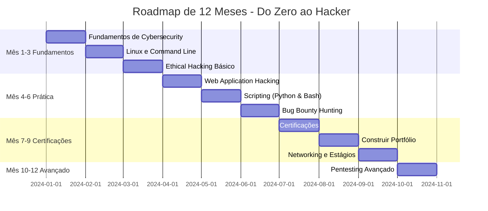

# Dummy To Hacker

Repo focado 100% em estudos de Red Team  
Do zero ao hacker

## Aviso Legal

Este repositório é **100% educacional** e focado em estudos de Red Team em ambiente controlado de laboratório. Todo o conteúdo é para fins de aprendizado, pesquisa e compreensão de segurança cibernética com propósito ético e responsável.

---

## Roadmap Visual de 12 Meses

## Roadmap Detalhado de 12 Meses - Do Zero ao Hacker

### Mês 1-3: Fundamentos em Cybersecurity & Ethical Hacking

#### 1. Aprenda o Básico de Cybersecurity
- Estude fundamentos de rede (TCP/IP, DNS, HTTP, VPNs, etc.)
- Aprenda sobre sistemas operacionais (Linux, Windows e macOS)
- Entenda firewalls, criptografia e VPNs

**Recursos recomendados:**
- **Livros:** "The Basics of Hacking and Penetration Testing" por Patrick Engebretson
- **Cursos:** 
  - "Introduction to Cybersecurity" (Cybrary, Coursera, Udemy)

#### 2. Domine Linux & Linha de Comando
- Instale Kali Linux e aprenda comandos básicos do Linux
- Aprenda Bash scripting para automação
- **Recomendado:** Linux+ Certification (CompTIA)

#### 3. Comece a Aprender Ethical Hacking & Penetration Testing
- Estude metodologias de ethical hacking (footprinting, scanning, exploitation)
- Pratique com ferramentas como Nmap, Wireshark e Metasploit
- Faça cursos de ethical hacking para iniciantes:
  - "Certified Ethical Hacker (CEH)" (EC-Council)
  - "Penetration Testing with Kali Linux (PWK)" pela Offensive Security

---

### Mês 4-6: Prática Hands-on & Especialização

#### 4. Pratique Web Application Hacking
- Aprenda sobre SQL injection, cross-site scripting (XSS) e remote code execution (RCE)
- **Plataformas de prática:**
  - Hack The Box (HTB)
  - TryHackMe (amigável para iniciantes)
  - OWASP Juice Shop para testes de segurança web

#### 5. Aprenda Scripting & Automação (Python & Bash)
- Aprenda Python para cybersecurity (escreva scripts para scanning, password cracking, etc.)
- Automatize tarefas com Bash scripting
- **Curso:** "Python for Cybersecurity" (Udemy)

#### 6. Explore Bug Bounty Hunting
- Cadastre-se em HackerOne, Bugcrowd ou Synack
- Aprenda a encontrar vulnerabilidades em aplicações reais
- Acompanhe hackers éticos como Ryan Montgomery, LiveOverflow e STÖK

---

### Mês 7-9: Certificações & Experiência no Mundo Real

#### 7. Obtenha uma Certificação em Cybersecurity
Escolha uma baseada no seu nível de habilidade:
- **CompTIA Security+** (Nível básico)
- **Certified Ethical Hacker (CEH)** (Intermediário)
- **Offensive Security Certified Professional (OSCP)** (Avançado, altamente respeitado)

#### 8. Construa um Portfólio de Trabalhos de Ethical Hacking
- Documente suas descobertas de CTF challenges, bug bounties e testes de penetração
- Comece um blog ou repositório GitHub mostrando sua pesquisa

#### 9. Candidate-se a Estágios em Cybersecurity ou Trabalho Freelance
- Procure por estágios de penetration testing ou cargos juniores em segurança
- Ofereça auditorias de segurança gratuitas para pequenas empresas para ganhar experiência
- Faça networking no LinkedIn, Twitter e fóruns de cybersecurity

---

### Mês 10-12: Hacking Avançado & Crescimento Profissional

#### 10. Domine Penetration Testing Avançado
- Aprenda exploração de Active Directory
- Fique confortável com operações Red Team vs. Blue Team
- Faça cursos avançados de pentesting (ex: "Red Team Ops" da Zero-Point Security)

#### 11. Comece a Falar em Público ou Ensinar
- Crie vídeos no YouTube, escreva posts em blog ou dê palestras sobre cybersecurity
- Candidate-se a competições CTF (ex: DEFCON CTF, Pwn2Own)

#### 12. Consiga Seu Primeiro Emprego Full-Time em Cybersecurity
- Candidate-se para cargos como Penetration Tester, Red Team Operator ou Cybersecurity Analyst
- Use seu portfólio, certificações e experiência para se destacar
- Continue fazendo networking, aprendendo e melhorando

---

## Projetos

### 01 - Scanner Básico de Portas TCP

**Status:** Completo | **Nível:** Iniciante | **Mês:** 1-3

Scanner básico de portas TCP desenvolvido em Python puro para entender fundamentos de rede, conexões TCP/IP e metodologia de scanning.

**O que você vai aprender:**
- Fundamentos de TCP/IP e conexões de rede
- Sockets em Python
- Threading para paralelização
- Primeira fase do penetration testing: Scanning

**Localização:** [`projects/01-basic-port-scanner/`](projects/01-basic-port-scanner/)

---

## Recursos Adicionais

### Plataformas de Prática
- [Hack The Box](https://www.hackthebox.com/)
- [TryHackMe](https://tryhackme.com/)
- [OWASP Juice Shop](https://owasp.org/www-project-juice-shop/)

### Plataformas de Bug Bounty
- [HackerOne](https://www.hackerone.com/)
- [Bugcrowd](https://www.bugcrowd.com/)
- [Synack](https://www.synack.com/)

### Instrutores e Recursos para Seguir
- Ryan Montgomery
- LiveOverflow
- STÖK

---

**Nota:** Este roadmap é um guia geral. Adapte-o conforme suas necessidades, ritmo de aprendizado e objetivos profissionais. Muitas coisas nele vão mudar ao longo do tempo.